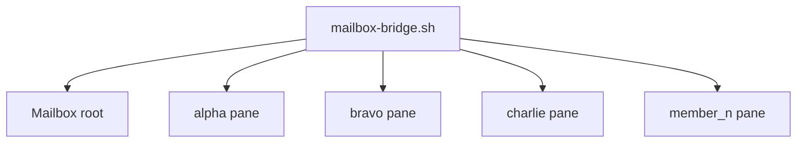
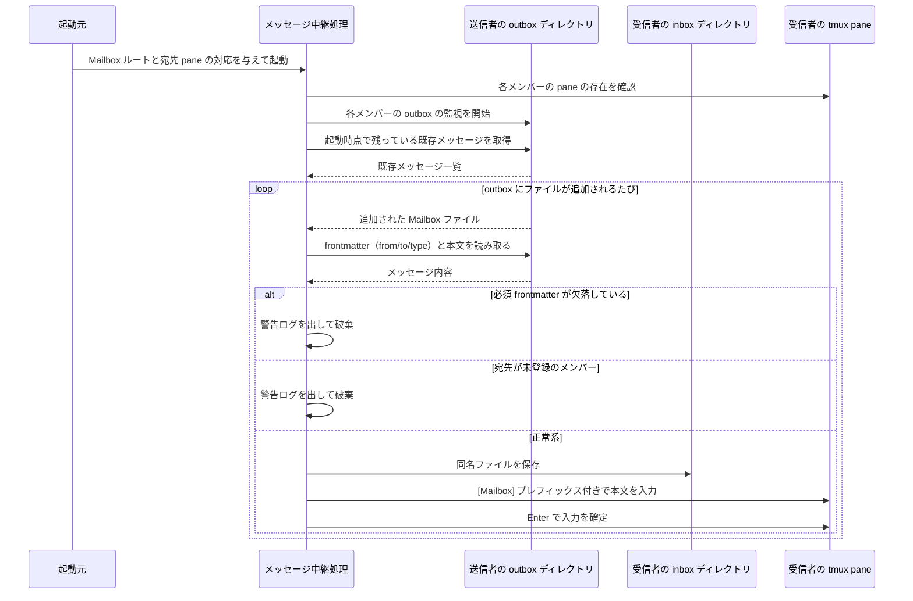

# ブリッジモジュール — 仕様書

## 実装ファイル

| ファイル | 説明 |
|---|---|
| `scripts/mailbox-bridge.sh` | 全メンバーの outbox を監視し、宛先ペインへ配送する常駐スクリプト |
| `scripts/install.sh` | `mailbox-bridge.sh` を `.ai-team/scripts/` に配置する |
| `scripts/uninstall.sh` | 配置した bridge スクリプトを除去する |

## 構成

## 処理フロー

### メッセージ中継

## 公開インターフェース

| スクリプト | 引数 | 説明 |
|---|---|---|
| `mailbox-bridge.sh` | `<mailbox_root>` `<member:pane>`... | Mailbox を監視して対象 pane に配送する |
| `install.sh` | なし | `.ai-team/scripts/mailbox-bridge.sh` を配置する |
| `uninstall.sh` | なし | 配置済み bridge を除去する |
