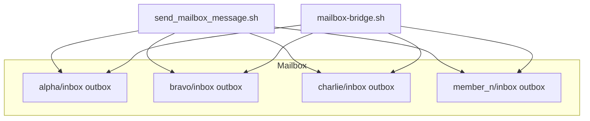
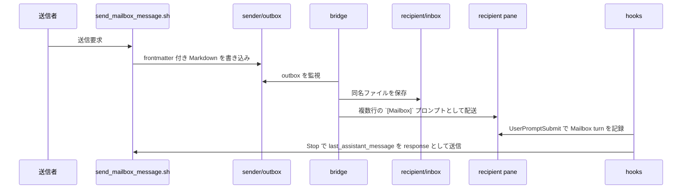

# 通信基盤モジュール — 仕様書

> 本書は [通信基盤モジュール要件定義書](./REQUIREMENTS.md) に基づく設計仕様である。

## 実装ファイル

| ファイル | 説明 |
|---|---|
| `scripts/mailbox-init.sh` | Mailbox ディレクトリ構造を作成 |
| `scripts/mailbox-cleanup.sh` | Mailbox ディレクトリを削除 |
| `scripts/mailbox-hook.sh` | Mailbox 自動返信用の共通 hook スクリプト |
| `scripts/send_mailbox_message.sh` | Mailbox メッセージ送信スクリプト |
| `skills/claude-code/mailbox-compose/SKILL.md` | Claude Code 用の明示的な新規送信用 skill |
| `skills/codex-cli/mailbox-compose/SKILL.md` | Codex CLI 用の明示的な新規送信用 skill |
| `skills/codex-cli/mailbox-compose/agents/openai.yaml` | Codex CLI 用 skill metadata |
| `scripts/install.sh` | プロジェクトへの配置処理 |
| `scripts/uninstall.sh` | 配置ファイルの除去処理 |

## 参照元

| 参照元 | 用途 |
|---|---|
| team-management | Mailbox 初期化 / cleanup |
| 全メンバー | `send_mailbox_message.sh` による送信 |
| 全メンバー | `mailbox-compose` skill による明示的な新規送信 |
| bridge | outbox 監視と inbox 保存 |

## 構成



## 処理フロー

### メッセージ送信



## 公開インターフェース

### スクリプト

| スクリプト | 呼び出し元 | 引数 | 説明 |
|---|---|---|---|
| `mailbox-init.sh` | team-management | `<member>...` | 現在の tmux セッションの Mailbox を初期化する |
| `mailbox-cleanup.sh` | team-management | なし | 現在の tmux セッションの Mailbox を削除する |
| `send_mailbox_message.sh` | hooks / 各メンバー | `--member --to --type --message [--internal-from-hook]` | 送信者 outbox にメッセージファイルを書き込む。`--internal-from-hook` は hook からの自動返信時に pending reply ガードをバイパスするための内部フラグ |
| `mailbox-hook.sh` | Claude / Codex hooks | `record-prompt \| flush-reply` | Mailbox 由来 turn を記録し、完了時に自動返信する |
| `mailbox-compose` | Claude / Codex skills | なし | 明示的な新規送信時に `send_mailbox_message.sh` を呼び出す |
| `install.sh` | セットアップ | `[--project-dir <path>]` | communication モジュールの成果物を配置し、hook を設定する |
| `uninstall.sh` | セットアップ | `[--project-dir <path>]` | communication モジュールが配置した成果物を除去する |

### インストール配置表

| 配置元 | 配置先 | 説明 |
|---|---|---|
| `scripts/mailbox-init.sh` | `.ai-team/scripts/mailbox-init.sh` | Mailbox 初期化スクリプト |
| `scripts/mailbox-cleanup.sh` | `.ai-team/scripts/mailbox-cleanup.sh` | Mailbox cleanup スクリプト |
| `scripts/mailbox-hook.sh` | `.ai-team/scripts/mailbox-hook.sh` | Claude Code / Codex CLI 共通の Mailbox hook スクリプト |
| `scripts/send_mailbox_message.sh` | `.ai-team/scripts/send_mailbox_message.sh` | Claude Code / Codex CLI 共通の Mailbox 送信スクリプト |
| `skills/claude-code/mailbox-compose/` | `.claude/skills/mailbox-compose/` | Claude Code 用の手動送信用 skill |
| `skills/codex-cli/mailbox-compose/` | `.agents/skills/mailbox-compose/` | Codex CLI 用の手動送信用 skill |
| `scripts/install.sh` の hook 設定 | `.claude/settings.json` | Claude Code の UserPromptSubmit / Stop hook |
| `scripts/install.sh` の hook 設定 | `.codex/hooks.json` | Codex CLI の UserPromptSubmit / Stop hook |
| `scripts/install.sh` の feature 設定 | `.codex/config.toml` | Codex hooks 有効化設定 |

### 起動時の連携

- 各エージェントは `AI_TEAM_MEMBER` により、自分の Mailbox hook state を分離して扱う
- Codex hooks の有効化は起動引数ではなく `.codex/config.toml` の feature flag で扱う

### Mailbox ディレクトリ構成

```text
.ai-team/{session_name}/mailbox/
├── {alpha}/
│   ├── inbox/
│   └── outbox/
├── {bravo}/
│   ├── inbox/
│   └── outbox/
├── ...
│   ├── inbox/
│   └── outbox/
└── {member_n}/
    ├── inbox/
    └── outbox/
```

- 送信者は自分の `outbox/` に書き込む
- bridge は受信者の `inbox/` に同名ファイルを保存してから対象ペインへ配送する
- `{alpha}` や `{bravo}` はチーム構成に応じた任意の mailbox ID の例を表す

### Mailbox メッセージ形式

YAML frontmatter + Markdown body。ファイル名は `{YYYYMMDDTHHMMSS}.md`。

```markdown
---
from: alpha
to: bravo
type: request
timestamp: 2026-04-12T12:00:00Z
---

Please implement the latest battle flow.
```

| フィールド | 必須 | 説明 |
|---|---|---|
| `from` | Yes | 送信元の mailbox ID（任意の構成可能なメンバー ID） |
| `to` | Yes | 宛先の mailbox ID |
| `type` | Yes | `request` / `response` / `question` / `error` |
| `timestamp` | Yes | ISO 8601 形式 |

## 自動返信ルール

- `UserPromptSubmit` hook は `[Mailbox]` と `From:` ヘッダを検知したときだけ pending reply state を保存する
- `Stop` hook は pending reply state がある turn のみ `last_assistant_message` を mailbox の `response` として送信する
- `last_assistant_message` が null / 空文字なら返信本文は `完了した。` とする
- bridge は `[Mailbox]`, `From:`, `Type:` を複数行のままペインへ貼り付ける

## 手動送信ルール

- 明示的な新規送信が必要なときだけ `mailbox-compose` skill を使う
- `mailbox-compose` は返信用ではなく、新しい依頼・質問・エラー報告を Mailbox へ流すための入口とする（skill から指定する `type` は `request` / `question` / `error` に限る）
