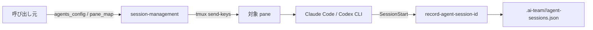
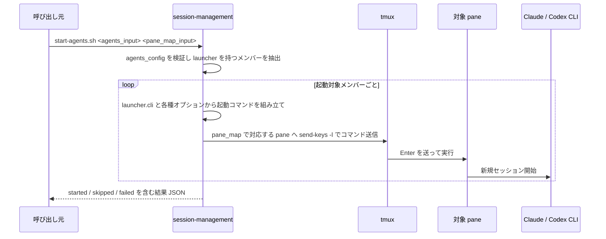
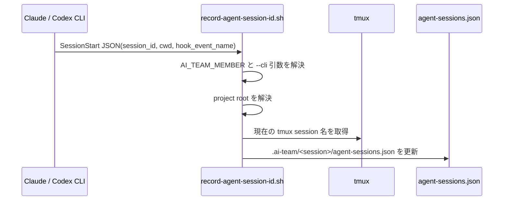
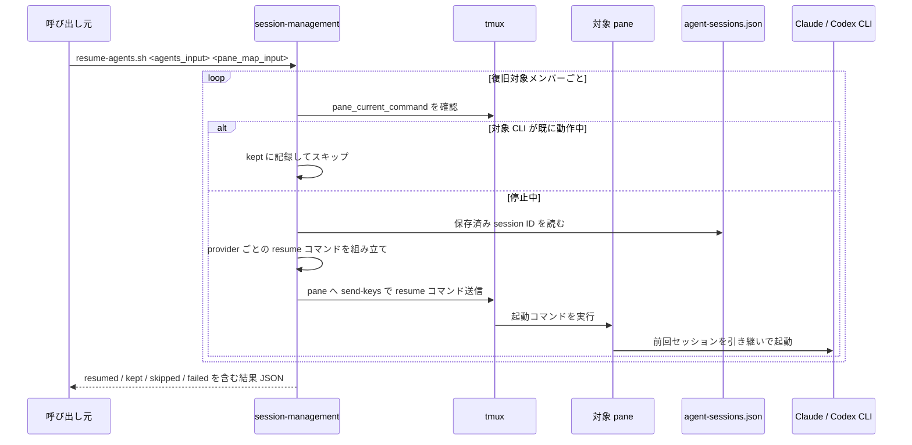

# セッション管理モジュール — 仕様書

> 本書は [セッション管理モジュール要件定義書](./REQUIREMENTS.md) に基づく設計仕様である。現行実装に合わせて、起動・復旧・SessionStart hook による session ID 保存方式を定義する。

## 実装ファイル

| ファイル | 説明 |
|---|---|
| `scripts/start-agents.sh` | エージェント構成と `member → pane_id` の対応を受け取り、各ペインで対象メンバーの CLI を新規起動する |
| `scripts/resume-agents.sh` | エージェント構成と `member → pane_id` の対応を受け取り、停止中メンバーだけを resume 起動する |
| `scripts/session-management-common.sh` | JSON 検証、tmux 操作、CLI ごとのコマンド組み立て、resume 用 state file 読み出しなどを担う共通ヘルパー |
| `scripts/record-agent-session-id.sh` | Claude / Codex の `SessionStart` hook から呼ばれ、各メンバーの session ID を state file へ保存する内部 hook |
| `scripts/install.sh` | 公開スクリプト、共通ヘルパー、SessionStart hook をプロジェクトへ配置し、Claude / Codex の hook 設定を登録する |
| `scripts/uninstall.sh` | install で配置したスクリプトと、本モジュールが追加した SessionStart hook 設定を除去する |

## インストール後の配置物

| 配置先 | 内容 |
|---|---|
| `.ai-team/scripts/start-agents.sh` | 共有の公開起動スクリプト |
| `.ai-team/scripts/resume-agents.sh` | 共有の公開復旧スクリプト |
| `.ai-team/scripts/session-management-common.sh` | start / resume 共通ヘルパー |
| `.ai-team/scripts/record-agent-session-id.sh` | Claude / Codex 共通の session ID 記録 hook 実体 |
| `.claude/settings.json` | `startup|resume` 用の Claude `SessionStart` hook 設定を追加する |
| `.codex/hooks.json` | `startup|resume` 用の Codex `SessionStart` hook 設定を追加する |
| `.codex/config.toml` | `[features] codex_hooks = true` を保証する |

## 参照元

| 参照元モジュール | 使用スクリプト | 用途 |
|---|---|---|
| team-management | `start-agents.sh` | チーム起動時のエージェント立ち上げ |
| team-management | `resume-agents.sh` | チーム復旧時のエージェント再起動 |

## インフラ構成図



本モジュールはペイン配置の責務を持たず、ペインは既に作成済みのものを受け取る。ペイン作成は別モジュールで行われる前提とする。

## 処理フロー

### エージェント起動（FR-SM1）



- Claude は `AI_TEAM_MEMBER=<member> claude ... --append-system-prompt "$(< prompt_path)"` を送る
- Codex は `AI_TEAM_MEMBER=<member> codex ... "<prompt text>"` を送る
- start 時点では state file を直接更新しない。session ID 保存は `SessionStart` hook に委譲する

### SessionStart hook による session ID 保存



- hook は `hook_event_name == "SessionStart"` と `session_id` を確認できたときだけ保存する
- 保存キーは CLI ごとに分ける
  - Claude: `members.<member>.claude_session_id`
  - Codex: `members.<member>.codex_session_id`
- hook は `startup|resume` の両方で登録するため、新規起動でも resume 起動でも最新の session ID を保存できる

### エージェント復旧（FR-SM2）



- Claude の復旧優先順
  - 保存済み `claude_session_id` がある場合: `claude --resume <id>`
  - 無い場合: `claude --continue`
- Codex の復旧優先順
  - 保存済み `codex_session_id` がある場合: `codex resume <id>`
  - 無い場合: `codex resume --last`

## 補足仕様

- 起動対象の判別は `launcher` 項目の有無で行う。`launcher` を持たないメンバーは start / resume の対象外とし、`skipped` に分類する
- 入力の `agents_input` と `pane_map_input` は、JSON 文字列または JSON ファイルパスのどちらでも受け付ける
- 起動コマンドの送信は `tmux send-keys -l` で文字列をそのまま送り、少し待ってから `Enter` を送る 2 段階方式を使う
- 動作中判定は `tmux display-message -p -t <pane> '#{pane_current_command}'` の結果と `launcher.cli` を比較して行う
- state file の保存先は `project_root/.ai-team/<tmux_session>/agent-sessions.json` とする
- `project_root` は hook から渡された `cwd` または現在ディレクトリを起点に `.git` / `.agents` / `.claude` / `.codex` を遡って解決する
- uninstall は本モジュールが追加した hook エントリだけを削除し、他モジュールも使う可能性がある `codex_hooks = true` は戻さない

## state file 形式

```json
{
  "members": {
    "reviewer": {
      "claude_session_id": "claude-session-123"
    },
    "builder": {
      "codex_session_id": "codex-thread-123"
    }
  }
}
```

## 外部依存

### tmux

| 項目 | 内容 |
|---|---|
| 用途 | 起動コマンド投入、現在の session 名取得、pane 上の現在コマンド確認 |
| バージョン | 3.x 以上 |

### jq

| 項目 | 内容 |
|---|---|
| 用途 | 入力 JSON 検証、hook 入力解析、state file 更新 |

### CLI

| 項目 | 内容 |
|---|---|
| Claude Code | `launcher.cli == "claude"` のメンバーに対して使用する |
| Codex CLI | `launcher.cli == "codex"` のメンバーに対して使用する |

### 外部条件

- リーダーは Claude Code のセッション上で動作していること。`start-agents.sh` / `resume-agents.sh` は `.ai-team/scripts/` に配置され、リーダー側の Claude Code セッションから呼び出される
- 対象ペインが呼び出し元により事前に作成され、`pane_id` が渡されていること
- 各メンバーの `launcher.prompt_path` が参照するファイルがプロジェクト内に存在すること
- SessionStart hook 実行時に `AI_TEAM_MEMBER` が各 CLI プロセスへ引き継がれていること

## 公開インターフェース

### スクリプト

| スクリプト | 引数 | 説明 |
|---|---|---|
| `start-agents.sh` | `<agents_input>` `<pane_map_input>` | 指定された各ペインでエージェントを新規起動する |
| `resume-agents.sh` | `<agents_input>` `<pane_map_input>` | 動作していないエージェントだけを再起動する |
| `install.sh` | `[--project-dir <path>]` | 公開スクリプトと hook を配置し、Claude / Codex の `SessionStart` hook を登録する |
| `uninstall.sh` | `[--project-dir <path>]` | 本モジュールが配置したスクリプトと `SessionStart` hook 設定を除去する |

`record-agent-session-id.sh` は内部 hook であり、呼び出し元モジュールから直接使う公開インターフェースには含めない。

### 入力フォーマット

#### `agents_config`（JSON）

team-management モジュールが扱う `agents.config.json` のフォーマットに準拠する。本モジュールは以下のフィールドを利用する。

| フィールド | 用途 |
|---|---|
| `members[].member` | メンバー ID。`pane_map` のキーと突合する |
| `members[].launcher.cli` | 起動する CLI 種別（`claude` / `codex`） |
| `members[].launcher.prompt_path` | 起動時に読む role prompt のパス |
| `members[].launcher.model` | 任意。モデル指定 |
| `members[].launcher.think_mode` | 任意。思考量指定 |
| `members[].launcher.permission_mode` | 任意。Claude 用の権限モード |
| `members[].launcher.sandbox` | 任意。Codex 用の sandbox 指定 |
| `members[].launcher.approval_policy` | 任意。Codex 用の承認ポリシー指定 |

#### `pane_map`（JSON）

メンバー ID → `pane_id` のマッピング。

```json
{
  "alice": "%12",
  "yuuka": "%13",
  "kei": "%14",
  "yuzu": "%15"
}
```

| フィールド | 型 | 説明 |
|---|---|---|
| キー | string | メンバー ID（`agents_config.members[].member` と一致） |
| 値 | string | tmux pane ID |

### 結果の形式

```json
{
  "started": ["reviewer", "builder"],
  "resumed": ["reviewer"],
  "kept": ["builder"],
  "skipped": ["leader"],
  "failed": []
}
```

| フィールド | 意味 |
|---|---|
| `started` | `start-agents.sh` で新規に起動したメンバー |
| `resumed` | `resume-agents.sh` で復旧したメンバー |
| `kept` | 既に動作中で、冪等性ガードにより触らなかったメンバー |
| `skipped` | `launcher` が無く対象外だったメンバー |
| `failed` | 起動または復旧に失敗したメンバー |
