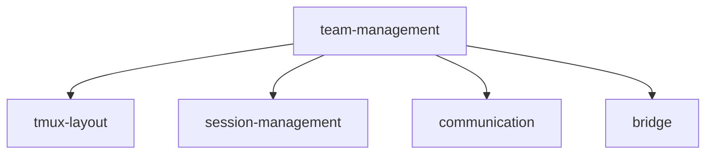
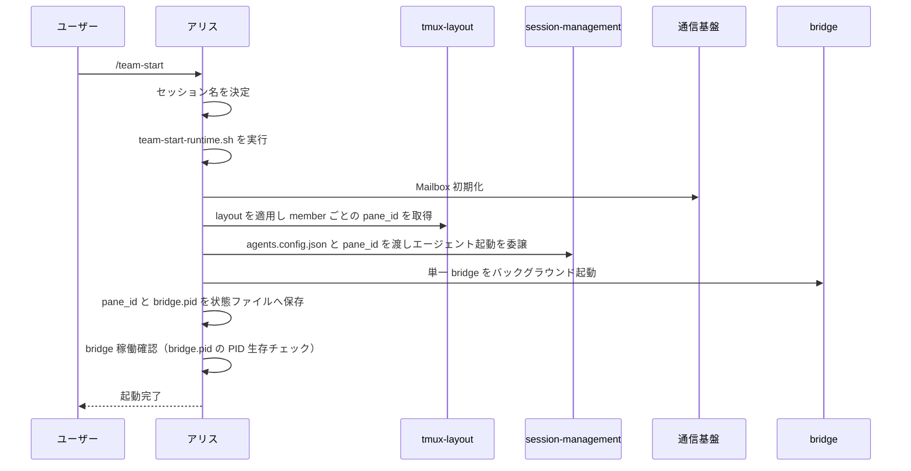
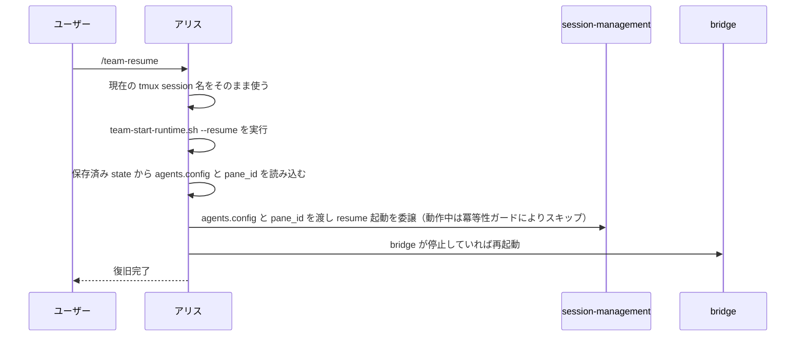
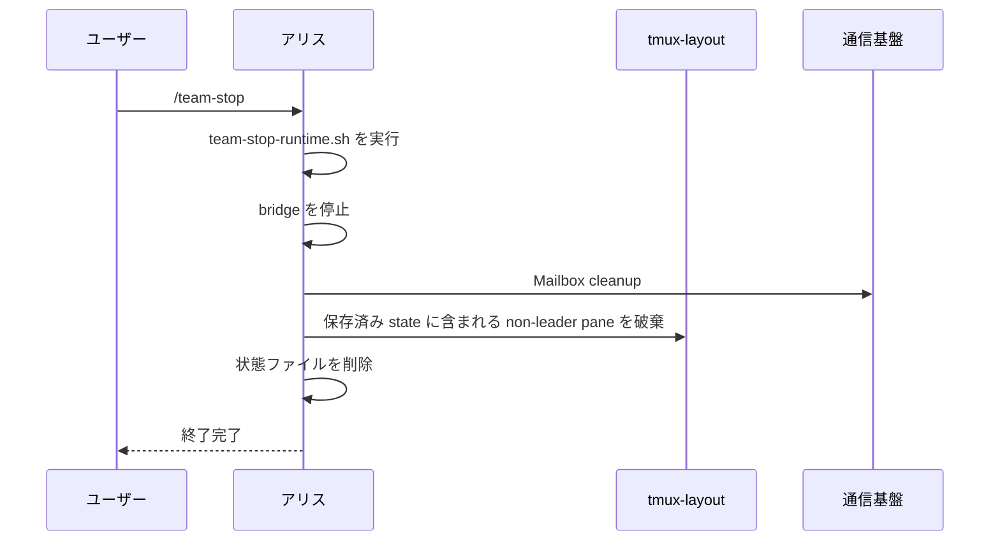

# チーム管理モジュール — 仕様書

## 実装ファイル

| ファイル | 種別 | 概要 |
|---|---|---|
| `.claude/skills/team-start/SKILL.md` | skill | チーム起動指示 |
| `.claude/skills/team-resume/SKILL.md` | skill | チーム復旧指示 |
| `.claude/skills/team-stop/SKILL.md` | skill | チーム終了指示 |
| `.ai-team/scripts/team-start-runtime.sh` | script | 外部 JSON を読み、通常起動では Mailbox 初期化・layout 適用・teammate 起動・bridge 起動を行い、`--resume` では保存済み state から teammate 復旧と bridge 起動を行う helper script |
| `.ai-team/scripts/team-stop-runtime.sh` | script | 保存済み state を読み、bridge 停止・pane 削除・state cleanup をまとめる helper script |
| `.ai-team/agents.config.json` | config | エージェント構成を定義する JSON |
| `.ai-team/layouts.config.json` | config | レイアウト定義を表す JSON |
| `scripts/install.sh` | script | skill ファイルを配置する |
| `scripts/uninstall.sh` | script | 配置した skill を除去する |

## 構成

本モジュールは特定のチーム構成（メンバー名・役割・人格）に依存しない。メンバーの具体構成・役割定義・人格設定は外部から `agents.config.json` / `layouts.config.json` と role prompt ファイルとして注入される。既定で配置される config は抽象的なテンプレート（`leader` + `teammate_a`/`teammate_b`/`teammate_c`）であり、利用者または上位モジュール（例: roles-workflow）が上書きすることを想定する。

## 処理フロー

### チーム起動シーケンス（FR-T1）

### チーム復旧シーケンス（FR-T2）

### チーム終了シーケンス（FR-T3）

## 外部依存

### tmux レイアウトモジュール

- レイアウト適用とペイン破棄に `apply-layout.sh` を使う
- 起動時はペインを作成し、`member` ごとの `pane_id` を解決する
- 終了時は保存済み状態にある non-leader pane を破棄する

### セッション管理モジュール

- エージェントの起動・復旧を委譲する
- `agents.config.json` の内容と、`member → pane_id` のマッピングを引数として渡す

### 通信基盤モジュール

- `mailbox-init.sh` / `mailbox-cleanup.sh`
- `.ai-team/scripts/send_mailbox_message.sh`
- `.codex/config.toml` に Codex hooks が有効化されていること

### ブリッジモジュール

- `.ai-team/scripts/mailbox-bridge.sh`

### role prompt（外部注入）

- leader を含む全メンバーの role prompt を `.ai-team/prompts/{member}.md` として配置すること
- 各 role prompt には、メンバー間コミュニケーションに必要なチーム構成の基礎知識を含めること
- チーム構成の基礎知識には、leader / teammate の `member` ID、各メンバーの担当領域、依頼・相談・報告時の宛先を含めること
- prompt の内容・構造・読み込み方針（persona 参照など）は本モジュールの関心外であり、配置元のモジュール（例: roles-workflow）または利用者の責務とする

## 公開インターフェース

| コマンド | 種別 | 説明 |
|---|---|---|
| `/team-start` | skill | チーム全体を新規起動する |
| `/team-resume` | skill | 保存済み状態を使ってチームを復旧する |
| `/team-stop` | skill | チーム全体を停止する |

## 実行方針

- skill から長い Bash コマンドを直接実行しない
- 長い処理は `.ai-team/scripts/team-start-runtime.sh` / `.ai-team/scripts/team-stop-runtime.sh` に切り出して実行する
- skill には手順と helper script 呼び出しだけを残す
- エージェント構成とレイアウトは `.ai-team/` 直下の JSON ファイルから外部入力として与える
- `team-start-runtime.sh` は引数で受け取った JSON を使って `mailbox-init.sh` と `apply-layout.sh` を実行する
- `team-resume` は tmux session 名を変更せず、`team-start-runtime.sh --resume` を使って保存済み state から復旧する
- bridge は `setsid` で tmux から切り離してバックグラウンド起動する

## `agents.config.json` 形式

- `member`: メンバー ID
- `leader`: リーダーなら `true`
- `mailbox`: Mailbox を作るなら `true`
- `bridge`: bridge の配送対象に含めるなら `true`
- `launcher`: 起動対象メンバーの CLI 定義
- `launcher.cli`: `claude` または `codex`
- `launcher.model`: 任意。エージェントごとの model 指定
- `launcher.think_mode`: 任意。エージェントごとの think モード指定
- `launcher.permission_mode`: Claude 用。任意
- `launcher.sandbox`: Codex 用。任意
- `launcher.approval_policy`: Codex 用。任意

起動コマンドは runtime が `launcher` の構造化項目から自動生成する。`launch_command` のような生コマンド文字列は使わない。
`launcher.model` / `launcher.think_mode` を省略した場合、runtime は対応する CLI フラグを付けず、各 CLI の既定設定へフォールバックする。
role prompt は `agents.config.json` には含めず、各 `member` について `.ai-team/prompts/{member}.md` として配置する。

`launcher.think_mode` は runtime 内で provider ごとのフラグへ変換される。
- Claude: `--effort`
- Codex: `-c model_reasoning_effort="..."`

## `layouts.config.json` 形式

辞書のリストであり、各要素が 1 メンバー分のペイン配置を表す。`member` により `agents.config.json` のメンバーと 1 対 1 に対応する。`pane_id` は実行時に runtime が解決する内部値であるため、本ファイルには含めない。

| フィールド | 型 | 説明 |
|---|---|---|
| `member` | string | メンバー ID。`agents.config.json` の `member` と一致する必要がある |
| `group_id` | int | ウィンドウ単位のグループ ID。番号が小さい順にウィンドウが並ぶ |
| `position` | string | ペインの目標位置（`top-left`, `top-right`, `bottom-left`, `bottom-right`, `top`, `bottom`, `whole`） |

- `agents.config.json` と `layouts.config.json` のメンバー集合は一致していなければならない
- `pane_id` はインターフェースとしては指定せず、runtime が `agents.config.json` の `leader` 情報から自動で解決する（リーダーは実行時の `TMUX_PANE`、非リーダーは新規作成用に `null`）
- runtime は member を取り除き、解決した pane_id を付与したうえで tmux-layout の `apply-layout.sh` に JSON を渡す

## 起動ポリシー

- 各メンバーの起動モード（権限・サンドボックス・承認ポリシー）は `agents.config.json` の `launcher` 項目で外部から指定する。team-management 自身は特定メンバーの起動モードをハードコードしない
- persona など追加の設定ファイルの読み込みは role prompt 内の参照に委ね、team-management は関与しない
