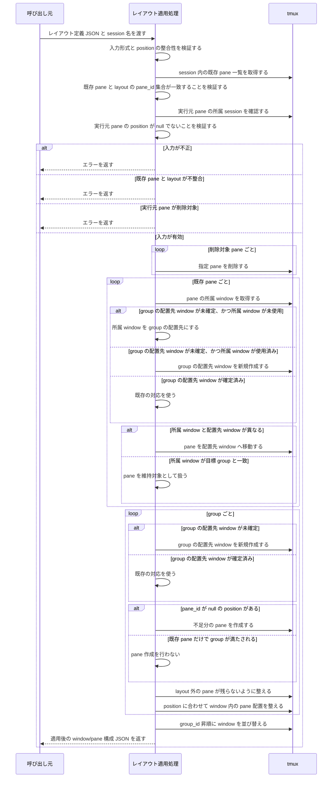

# tmux レイアウトモジュール — 仕様書

> 本書は [tmux レイアウトモジュール要件定義書](./REQUIREMENTS.md) に基づく設計仕様である。内部処理のロジックについては最小限に留めること。

---

## 実装ファイル

| ファイル | 説明 |
|---|---|
| `scripts/apply-layout.sh` | レイアウト定義に基づきペイン構成を適用する（ペインの移動・削除・新規作成） |
| `scripts/install.sh` | apply-layout.sh を `.ai-team/scripts/` に配置するインストールスクリプト |
| `scripts/uninstall.sh` | install.sh で配置したファイルを除去するアンインストールスクリプト |

---

## 参照元

| 参照元モジュール | 使用スクリプト | 用途 |
|---|---|---|
| session-management | `apply-layout.sh` | エージェント起動・復旧時のペイン再配置 |

---

## インフラ構成図


本モジュールは tmux のペイン識別に関する独自の仕組みを持たない。呼び出し元が `pane_id` を含むレイアウト定義を渡し、`apply-layout.sh` はその指示に従ってペインを操作する汎用ツールである。

---

## 処理フロー

### レイアウト適用（FR-S1）



### 補足

- レイアウト適用開始時点で session 内に存在する pane は、維持・移動・削除のいずれの場合も layout に `pane_id` として含まれている必要がある。
- `apply-layout.sh` を実行している pane は、対象 session に属しており、かつ `position` が `null` であってはならない。
- group の配置先 window は、既存 pane の現在地から決定する。既存 pane の現在地を配置先にできない場合、または `pane_id: null` だけの group の場合は、必要になった時点で window を新規作成する。
- 新規作成した window は、layout で指定された pane 構成だけが残るように整える。
- window 内の position 調整では一時 window や保護用 pane を作成せず、対象 window 内の pane を直接再配置する。
- `position` の整合性は、同一 group 内の指定が 2x2 領域を重複なく覆うかどうかで判定する。

---

## 外部依存

### tmux

| 項目 | 内容 |
|---|---|
| 用途 | ウィンドウ・ペインの作成・移動・削除 |
| バージョン | 3.x 以上 |

---

## 公開インターフェース

### スクリプト

| スクリプト | 引数 | 説明 |
|---|---|---|
| `apply-layout.sh` | `<layout_json>` `<session_name>` | レイアウト定義に基づきペイン構成を適用し、適用結果を JSON で stdout に出力する。`install.sh` により `.ai-team/scripts/apply-layout.sh` に配置される |
| `install.sh` | なし | `apply-layout.sh` を `.ai-team/scripts/` に配置する |

`apply-layout.sh` は tmux が設定する環境変数 `TMUX_PANE` を参照し、実行元 pane を判定する。

### レイアウト定義（入力）

`apply-layout.sh` に渡す JSON。辞書のリストであり、各要素が 1 つのペイン操作を表す。呼び出し元が `pane_id` を直接指定するため、本モジュールはペインの識別に関する独自の仕組みを持たない。

適用開始時点で session 内に存在する pane は、維持・移動・削除のいずれの場合も `pane_id` として入力に含める必要がある。`pane_id: null` は、適用処理の中で新規作成する pane のみに使用する。

`TMUX_PANE` が示す実行元 pane の entry は、`position: null` にしてはならない。

```json
[
  { "group_id": 0, "pane_id": "%5",  "position": "left" },
  { "group_id": 0, "pane_id": "%6",  "position": "top-right" },
  { "group_id": 0, "pane_id": null,  "position": "bottom-right" },
  { "group_id": 1, "pane_id": "%7",  "position": "left" },
  { "group_id": 1, "pane_id": "%8",  "position": "right" },
  { "group_id": null, "pane_id": "%9", "position": null }
]
```

| フィールド | 型 | 説明 |
|---|---|---|
| `group_id` | int \| null | ウィンドウ単位のグループ ID。番号が小さい順にウィンドウが並ぶ。`position` が `null` の場合は `null` |
| `pane_id` | string \| null | 既存ペインの tmux ペイン ID（例: `%5`）。新規作成の場合は `null` |
| `position` | string \| null | ペインの目標位置。`top-left`, `top-right`, `bottom-left`, `bottom-right`, `top`, `bottom`, `left`, `right`, `whole`（ウィンドウ全体）。削除する場合は `null` |

同一 group 内の position は、`top-left`, `top-right`, `bottom-left`, `bottom-right` の 4 つの基本領域を重複なく覆う必要がある。`left` と `top-right` / `bottom-right` のように 2 ペイン系と 4 ペイン系が混在しても、占有領域が重ならなければ有効である。

### 適用結果（出力）

`apply-layout.sh` が stdout に出力する JSON。適用後のウィンドウ・ペイン構成を返す。呼び出し元はこの結果を使って、新規作成されたペインへの CLI 起動などの後続処理を行える。

```json
{
  "@1": [
    { "pane_id": "%5",  "position": "left" },
    { "pane_id": "%6",  "position": "top-right" },
    { "pane_id": "%10", "position": "bottom-right" }
  ],
  "@2": [
    { "pane_id": "%7",  "position": "left" },
    { "pane_id": "%8",  "position": "right" }
  ]
}
```

| フィールド | 型 | 説明 |
|---|---|---|
| キー | string | tmux の window_id（例: `@1`） |
| `[].pane_id` | string | 適用後のペイン ID。新規作成されたペインには新しい ID が割り当てられる |
| `[].position` | string | 適用された位置 |
